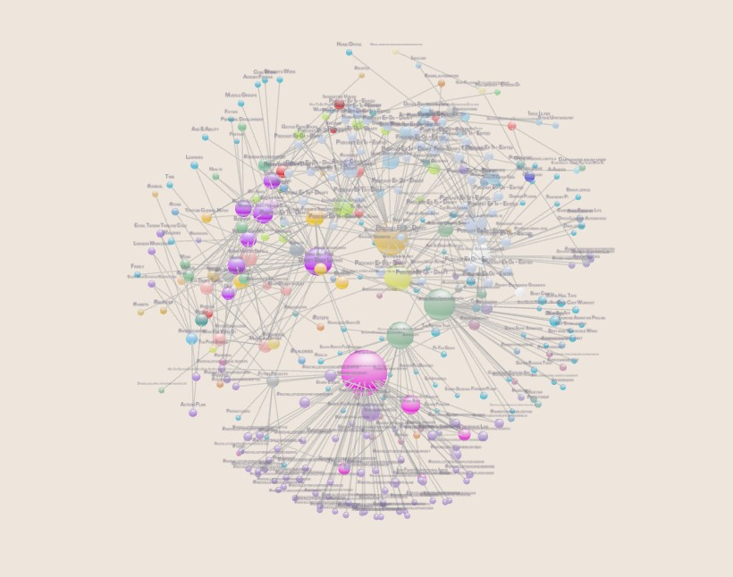
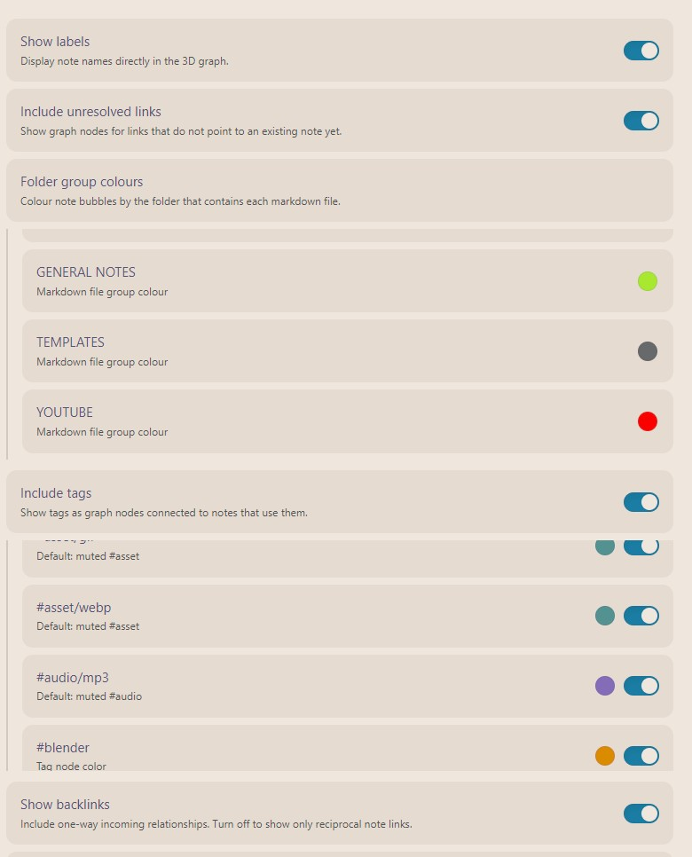
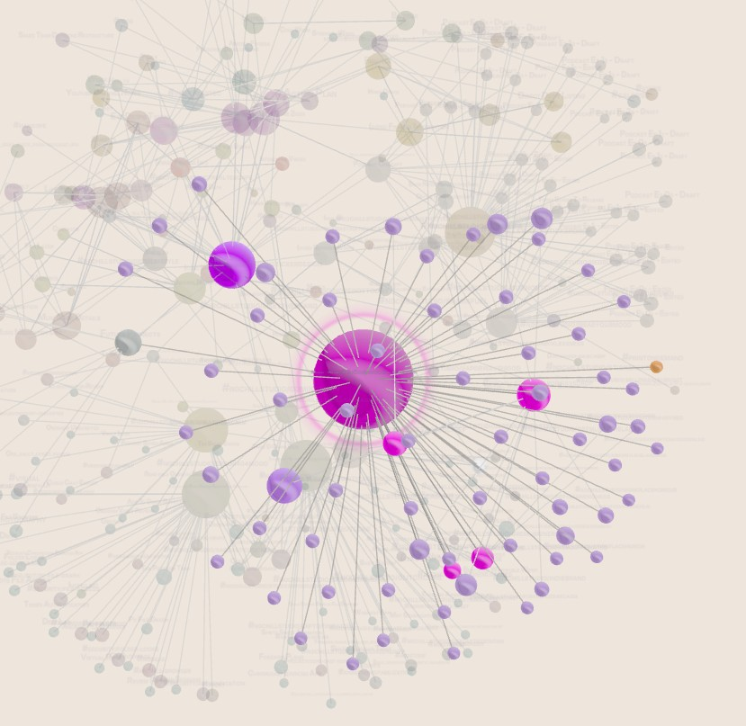

# Three D Graph View

Built by **Sidepath Studio**.



Built by Sidepath Studio - small apps, practical tools, and digital experiments.

Three D Graph View is a released Sidepath Studio tool for Obsidian, built to make vault structure easier to explore from another angle.

## Overview

Three D Graph View adds a rotatable, graph-style view for exploring notes, links, backlinks, folders, tags, and vault growth over time.

It is designed for visual scanning: find clusters, see folder groups, inspect direct relationships, and keep the note you are working on visible inside a larger vault structure.

## Find the note you are working on

The currently open markdown note is brought into focus and marked with a subtle pulse and sonar ping.

[Watch the active note sonar demo](assets/videos/active-node.mp4)

## Folder and tag colouring

Colour note bubbles by folder, then layer tag nodes on top for another way to read structure across the vault.



## Explore connected notes

Hover over a node to keep it and its direct connections clear while the rest of the graph fades back.



## Watch your vault build over time

Timelapse mode replays the graph in note creation order, making the shape of the vault easier to understand as it grows.

[Watch the timelapse demo](assets/videos/timelapse.mp4)

## Features

- Rotate, pan, zoom, and auto-rotate through a 3D vault graph.
- Core-to-surface spherical layout for a globe-like graph volume.
- Folder-based note colours with per-folder colour controls.
- Optional tag nodes with per-tag colours and muted sub-tag inheritance.
- Current note focus with pulse and sonar ping.
- Hover highlighting for a node and its direct connections.
- Viewport-aware fit with dense-centre rotation.
- Timelapse replay based on note creation order.
- Settings for labels, unresolved links, backlinks, tag visibility, disconnected group spread, node size, and sphere strength.

## Usage

Open the command palette and run **Open 3D graph view**.

The graph toolbar includes refresh, fit, settings, timelapse, and auto-rotate controls.

## Manual installation

Download `main.js`, `manifest.json`, and `styles.css` from a release and copy them into:

```text
<vault>/.obsidian/plugins/three-d-graph-view/
```

Then enable **Three D Graph View** in Obsidian's community plugin settings.

## Development

```bash
npm install
npm run dev
```

For a production bundle:

```bash
npm run build
```

## Brand

Three D Graph View is built by Sidepath Studio - small apps, practical tools, and digital experiments.

## License

MIT
